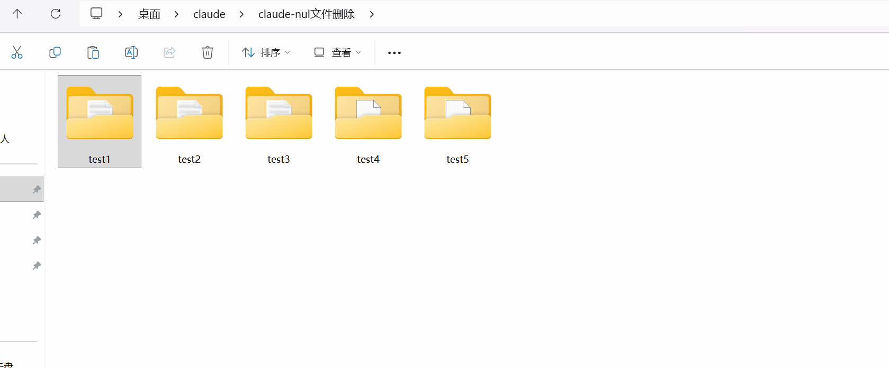
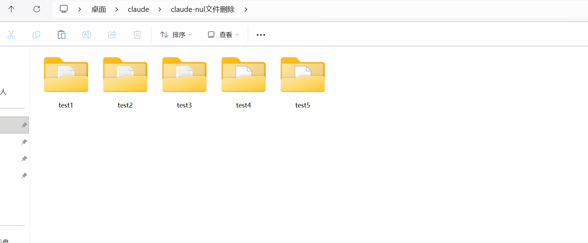

# nonul

[English](README.md)

替换 Windows 资源管理器右键菜单中**文件夹**的「删除」。用户看到的还是一个「删除」，但这个版本能处理含 `nul` 文件的文件夹。

## TL;DR

装完之后，右键删除文件夹就能删除含有nul文件的文件夹，解决使用claude code的项目删除时需要先处理nul文件的烦躁。

## 演示

**安装前：**



**安装后：**



## 如何使用？

两种方式任选其一，装完立即生效，无需其他操作，你的windows文件资源管理器右键菜单中的删除将能够直接删除含有nul文件的文件夹。

<sub>尽管项目提供了可靠的 uninstall 命令，你当然也可以在安装前手动备份当前的注册表配置：注册表编辑器--文件--导出</sub>

### irm（无需任何工具）

安装：

```powershell
irm https://raw.githubusercontent.com/4laoshiren/nonul/main/nonul.ps1 | iex
```

卸载：

```powershell
irm https://raw.githubusercontent.com/4laoshiren/nonul/main/nonul.ps1 -OutFile nonul.ps1; .\nonul.ps1 -Uninstall
```

### Scoop

安装：

```powershell
scoop bucket add nonul https://github.com/4laoshiren/nonul
scoop install nonul
```

卸载：

```powershell
scoop uninstall nonul
```

## 为什么需要这个？

`nul` 是 Windows 保留设备名。如果一个文件夹里有叫 `nul` 的文件，整个文件夹都删不掉——资源管理器会报错，`rd /s` 也不行。

Claude Code 在 Windows 上会在工作目录中创建无法删除的 `nul` 文件，这是一个已知且被大量报告的 bug。使用 Claude Code 一段时间后，项目目录中就会散落多个 `nul` 文件，导致整个项目文件夹无法删除。

相关 issue：
[#4928](https://github.com/anthropics/claude-code/issues/4928)
[#5449](https://github.com/anthropics/claude-code/issues/5449)
[#10543](https://github.com/anthropics/claude-code/issues/10543)
[#10552](https://github.com/anthropics/claude-code/issues/10552)
[#15398](https://github.com/anthropics/claude-code/issues/15398)
[#16642](https://github.com/anthropics/claude-code/issues/16642)
[#17783](https://github.com/anthropics/claude-code/issues/17783)
[#17886](https://github.com/anthropics/claude-code/issues/17886)
[#23942](https://github.com/anthropics/claude-code/issues/23942)
[microsoft/vscode#290986](https://github.com/microsoft/vscode/issues/290986)

目前唯一的删除方式是通过命令行执行 `[System.IO.File]::Delete('\\?\完整路径')`，但这对日常使用很不直观——删除项目应当可以右键删除。

## 项目做了什么？

> 一言以蔽之：在注册表的文件夹操作中里创建了一个delete键，此键存在时，会覆盖原生右键文件夹删除操作。此delete键的逻辑为，调用wscript.exe，删文件夹之前先清理其中的 `nul` 文件。

具体说：

安装时：

1. 在 `%LOCALAPPDATA%\nonul\` 下生成 `delete-directory.vbs` 辅助脚本
2. 创建注册表键 `HKCU\Software\Classes\Directory\shell\delete`，设置：
   - 默认值：`删除(&D)`（显示名称，和原生一致）
   - `Icon`：`shell32.dll,-240`（删除图标，和原生一致）
3. 创建子键 `HKCU\Software\Classes\Directory\shell\delete\command`，设置：
   - 默认值：`wscript.exe "%LOCALAPPDATA%\nonul\delete-directory.vbs" "%1"`

当用户右键删除文件夹时，Windows 会优先使用 `HKCU` 下的 `shell\delete` 覆盖原生行为，调用链为：

```
wscript.exe（无窗口启动器）→ VBS 脚本 → powershell.exe（静默执行实际删除逻辑）
```

卸载时：

1. 删除注册表键 `HKCU\Software\Classes\Directory\shell\delete`（恢复原生删除）
2. 删除 `%LOCALAPPDATA%\nonul\` 目录（清理辅助脚本）

## 为什么只处理文件夹，不处理单个文件？

作为更改注册表的项目，结构应尽可能简单。常规需要删nul文件的场景就是需要删除整个项目，即整个文件夹。由于nul文件并不会对项目有实际影响，不存在必须要单独删除nul文件的场景。

## 它怎么工作？

安装后，文件夹的右键「删除」会被替换为 nonul 版本：

```
右键删除文件夹
  → 递归找出文件夹里所有叫 nul 的文件（不区分大小写）
  → 用 \\?\ 前缀路径逐个删除
  → 把文件夹送进回收站
```

对于不含 `nul` 的文件夹，和原生删除完全一致。

## License

MIT
